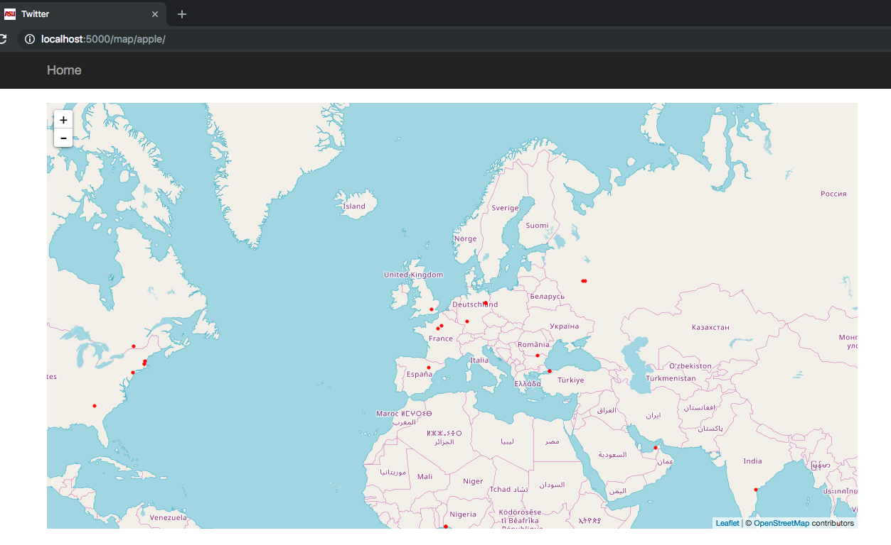

# Twitter Analysis

Twitter Analysis using Tweepy for fetching tweets, TextBlob for text analytics and Leaflet for interactive map visualizations.



## Technologies

* Python 3
* [Flask](http://flask.pocoo.org/)
* [Bootstrap](https://getbootstrap.com/)
* Javascript
* (Optional) [Docker](https://www.docker.com/)
* [Tweepy](http://www.tweepy.org/): an easy-to-use Python library for accessing the Twitter API
* [TextBlob](https://textblob.readthedocs.io/): library for processing textual data. It provides a simple API for diving into common natural language processing (NLP) tasks such as part-of-speech tagging, noun phrase extraction, sentiment analysis, classification, translation, and more
* [Leaflet](https://leafletjs.com): open-source JavaScript library for mobile-friendly interactive maps

## Deployment

You can either use virtual environments or Docker containers:

### a) Virtual Environment using Bash

Creation of a virtual environments done by executing the command venv:
```python
$ python3 -m venv env
```

Command to activate virtual environment:
```python
$ source env/bin/activate
```

Install dependencies:
```python
(env) $ pip install -r requirements.txt
```

List the libraries installed on your environment:
```
(env) $ pip freeze
```

Fetch tweets
```python
$ python fetch.py -q <keyword>
e.g. $ python fetch.py -q obama
```

Run the development server:
```
(env) $ python app.py
```

When you are done, the command to deactivate virtual environment:
```
(env) $ deactivate
```

### b) Docker

To be added soon...

## Resources 

* [Viz Template](https://github.com/dazcona/viz)
* [Marco Bonzanini's Blog](https://marcobonzanini.com/2015/06/16/mining-twitter-data-with-python-and-js-part-7-geolocation-and-interactive-maps/), [Demo](http://bonzanini.github.io/mining-twitter/rugby-osm.html)